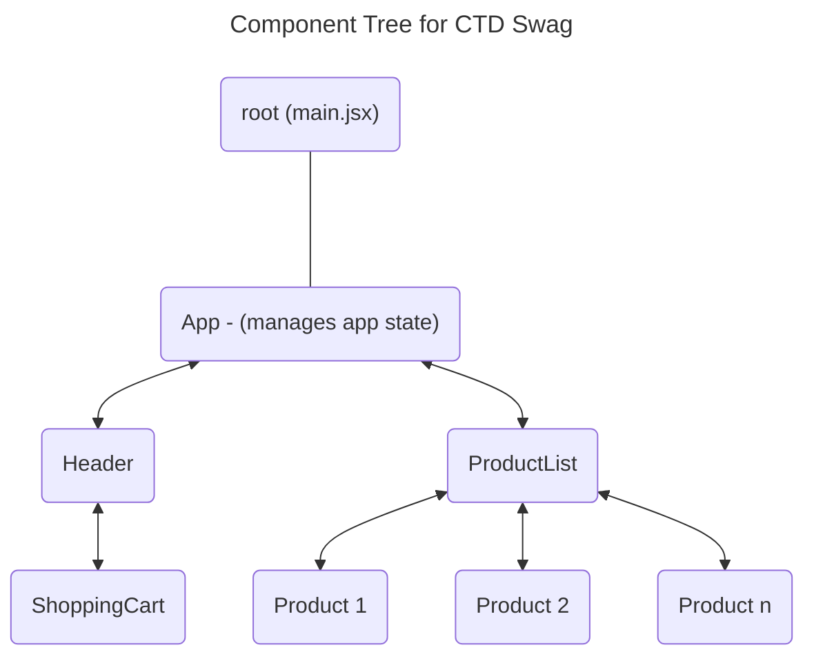

# Week-02

## Introduction

### Topics Covered

- ReactDOM
- Components
- JSX
- Troubleshooting

### Lesson Objectives

By the end of this lesson, we will:

#### Objective 1: ReactDOM

- Explain the purpose and role of ReactDOM within React applications
- Use createRoot to render a React application in a web page

#### Objective 2: Components

- Define a component and explain their role in building a UI
- List React's common components
- Describe the anatomy of a component
- List the contents of a component file
- Describe the component tree

#### Objective 3: JSX

- Understand advantages of using JSX syntax inside components
- Identify how JSX combines JavaScript with HTML
- List the rules of the JSX syntax
- Describe how Vite.js compiles JSX to JavaScript so the application renders in a browser

#### Objective 4: Troubleshooting

- Discuss common hurdles in React development and how error messages can be used to help developers troubleshoot their application
- Use browser debugging tools to pinpoint and resolve bugs in their code

## Discussion Topics

### ReactDOM

We know that React is a front end library used to design user interfaces. Aside from web, it can be used for mobile app development with React Native or other tools. When using React to build a web application, we include [ReactDOM](https://react.dev/reference/react-dom). This library provides web-specific features including built-in components for common html elements, additional APIs, and hooks.

ReactDOM is already set up inside of our project, courtesy of the React template that we used. Let's see how everything goes together. `react-dom` is listed in our package.json dependencies when we installed our project. Inside of `main.jsx` there is an import of an API method, `createRoot`. During runtime, `createRoot` is invoked to set up a location for React to render the passed component. To use, we pass `createRoot` an element selection (`document.getElementById('root')`) with a chained `render()` function containing a component to render.

```jsx
//Main.jsx

import { StrictMode } from "react";
import { createRoot } from "react-dom/client";
import App from "./App.jsx";
import "./index.css";

createRoot(document.getElementById("root")).render(
  <StrictMode>
    <App />
  </StrictMode>,
);
```

From here we have two directions to go to identify how everything is tied together. The first is to find the element with the id of `root`. It's not found in `/src` anywhere. Recall that `index.html` in the root directory is the entry point for the application. In that file, we will find a div with an id of `root`. When Vite starts, it serves up this file. The script loaded on line 11 is our application! Once it loaded, the script runs which renders the application inside of that div. If there is anything in that element, it removes it first.

```html
<!doctype html>
<html lang="en">
  <head>
    <meta charset="UTF-8" />
    <link rel="icon" type="image/svg+xml" href="/vite.svg" />
    <meta name="viewport" content="width=device-width, initial-scale=1.0" />
    <title>Vite + React</title>
  </head>
  <body>
    <div id="root"></div>
    <script type="module" src="/src/main.jsx"></script>
  </body>
</html>
```

The other item to look at is the argument that we pass to `render()`. `StrictMode` is a special component used during development that assists with finding bugs. It's time to talk about one of the fundamental concepts that makes React such a powerful tool.

### Components

#### What is a Component

> [!drafting note] #drafting-note
> elaborate on the "essentially a JS function…"

Now that we understand how ReactDOM ties into the application, it's time to explore one of the fundamental concepts that makes React such a powerful tool. Components are the building blocks of any React application. A modern[^class-component] React component is essentially a JavaScript function that does some isolated work and returns html. They allow us to break down a UI into smaller elements that can be tied together or re-used as needed.

To look at the structure of a component, we need to convert the JSX syntax to JavaScript. More on JSX soon. For now, we'll convert our `App` component to plain JavaScript. The original file looks like:

```jsx
import ctdLogo from "./assets/mono-blue-logo.svg";
import "./App.css";

function App() {
  return (
    <div className="coming-soon">
      <h1>CTD Swag</h1>
      <div style={{ height: 100, width: 100 }}>
        
      </div>
      <h2>Coming Soon...</h2>
    </div>
  );
}

export default App;

```

The following JavaScript version of `App` is functionally identical to the original.

```javascript
import React from "react";
import ctdLogo from "./assets/mono-blue-logo.svg";
import "./App.css";
function App() {
  return React.createElement(
    "div",
    {
      className: "coming-soon",
    },
    React.createElement("h1", null, "CTD Swag"),
    React.createElement(
      "div",
      {
        style: {
          height: 100,
          width: 100,
        },
      },
      React.createElement("img", {
        src: ctdLogo,
        alt: "Code The Dream Logo",
      }),
    ),
    React.createElement("h2", null, "Coming Soon..."),
  );
}
export default App;

```

There certainly is a lot of `React.createElement`s! Each one accepts a `type`, a `props` object, and `…children` arguments.

> [!remember]
> The three dots (…) before `children` indicate the use of JavaScript's [rest parameter](https://developer.mozilla.org/en-US/docs/Web/JavaScript/Reference/Functions/rest_parameters) syntax. Any of the remaining arguments beyond `type` and `props` provided to `createElement` will become an array of `children` arguments.

- **`type`**: tag name string or a component to be rendered
- **`props`**: object containing information to configure the element
	- examples include `className` on line 9, `style` on line 15, and `src` and `alt` on lines 21-2
	- if not used, it must contain an empty object or `null`
- **`…children`**: Optional. One or more nodes that are nested into the element being created. This can also include text content such as found in a heading, paragraph, etc. Each nested `React.createElement` in the code above is found in `…children` arguments of its parent.

> [!note]
> `props` is an object.

#### Defining a Component

We can use function declarations, function expressions, or arrow functions - each are equally valid.

> [!drafting note] #drafting-note
> update examples to use JS not JSX

```jsx

function Component1(){
  return(
    <p>Component1 uses a function declaration</p>
  );
}

//or

const Component2 = function(){
  return(
    <p>Component2 uses a function expression</p>
  );
}

//or

const Component3 = () => {
  return <p>Component3 uses an arrow function</p>
}

//or

const Component4 = () => <p>Component4 uses an arrow function with implicit return</p>

function App() {
  return (
    <>
      <Component1/>
      <Component2/>
      <Component3/>
      <Component4/>
    </>
  )
}
```

Renders out to:

![[202410_1124AM-Firefox Developer Edition.png|600]]

Although a component is just a function, there are a few rules to follow when creating them.

- The name must be capitalized.
- It must be a pure function.
	- Its return values are always the same given the same inputs.
	- No side effects[^side-effects] should happen during render. These must happen outside the render cycle.
		- Mutations local to the component during render is acceptable. Example: pushing items into an array that is then rendered into list items.
	- Don't make direct changes (mutate) to props or state. We'll cover making updates to these next week.

There are also a few best practices to follow:

- Use PascalCase if the component name is multi-worded(eg - `BackButton`.
- Named or default exports[^avoid-anonymous] are both acceptable but should be consistent across the codebase. We recommend sticking with `default export SomeComponent`.
- Each component should have its own file.
- The file name should match the component name. Eg - `Header` component should go in a file named `Header.jsx`.

#### Built-in Components

React includes several built-in components - we've already ran into the two used in the course.

- **Fragment**: allows us to group elements together without affecting the DOM structure. The shorthand `<></>` is used in most cases.
- **StrictMode**: a special development tool that adds behaviors to the application that reveal common React bugs
	- components mount twice to expose impure renders
	- effects are re-ran to validate cleanup functions work correctly - more details about useEffect will be covered [[Week-08|week 8]] #drafting-note/incorrect
	- flags use of [deprecated](https://en.wikipedia.org/wiki/Deprecation) APIs
	- It's added to our project automatically with Vite's React template. It may be tempting to remove it to suppress odd behaviors (especially with useEffect) but don't. Again, errors are our friends and they'll guide us to the right path!

ReactDOM provides common components for all of the elements that can be found in an html document. When using `div`, `button`, or `input` for example, they are not directly referencing the native HTML element itself. We are using component representations which also provide a host of built in props and events. The [common components](https://react.dev/reference/react-dom/components/common) are too numerous to list here but are worth reviewing.

#### The Component Tree

> [!drafting note] #drafting-note
> keep current with latest from app



When assembling components, the hierarchical structure that is formed is called a component tree. At the top of the tree is the root component, with child components branching out from it to form an inverted tree-like structure. Where each branch forms, the component that contains further sub-components is referred to as a parent component. Each component in the tree encapsulates a specific part of the UI and can contain other components as children. The component tree visually depicts the relationships and dependencies between components, illustrating how data flows from parent components to their children through props, and how updates propagate downward through the tree via state and context. This tree structure is fundamental to understanding how components are composed and nested within a React application.

### JSX

Writing components in JavaScript is possible but becomes but becomes tedious as a component grows. JSX provides a more concise and expressive syntax for defining UI components. JSX stands for **JavaScript XML**. It is a syntax extension for JavaScript that Vite transpiles down to JavaScript using [[Week-01#Sub-tools|esbuild]]. #placeholder/link/internal JSX resembles HTML, making it easier for developers to visualize the component structure and to write code that closely resembles the final UI.

When we place custom or built-in components into JSX with `<>` brackets, that element is commonly referred to as an "instance" of that component. JSX also allows for embedding JavaScript expressions directly in the markup using `{}` brackets.

#### Rules of JSX

To keep the transpilation process simple and performant, we must follow some rules:

- a component must return a single React element or component.
	- This element can contain one or more child elements.
	- React includes a special component `Fragment` or written in shorthand as `<></>` that acts as a wrapper element for sibling elements. It gets stripped out during render time.

JSX

```jsx
<> //React's fragment is easy to identify and saves a lot of space in the code
  <h1>CTD Swag</h1>
  <p>We have merch!!!</p>
  <ul>
    <li>tee shirt</li>
    <li>bucket hat</li>
  </ul>
</>
```

- All tags must be terminated. They either have to have an accompanying closing tag (`<div></div>`) or be self-closing (``).

HTML

```html
<!-- valid HTML but INVALID JSX -->

<input val="">
```

JSX

```jsx
<>
    {/*valid JSX*/}
    
    <input val="" />
</>
```

- Most keys and attributes must be camelCase
	- [aria-*](https://developer.mozilla.org/en-US/docs/Web/HTML/Global_attributes/data-*) + [data-*](https://developer.mozilla.org/en-US/docs/Web/Accessibility/ARIA/Attributes) are still written with dashes
- `class` and `for` are reserved words in JavaScript so `className` and `htmlFor` are used in their place.
- JavaScript blocks inside JSX must be wrapped with curly brackets `{}`
	- don't use single line JS comments, eg. `//some comment`
	- if a code block has a return value, it should be a valid React element
	- code blocks can be nested in other code block return statements

JSX

```jsx
{/*single line comment*/}
{/*
    longer comments
    can be written
    using multiple lines
*/}
<div>
  {isLoggedIn ? <p>Welcome {userName}!</p> : <button onClick={() => logIn()}>Log In</button>}
  <ul>
    {products.map((product)=> <li>{product.name}</li>)}
  </ul>
</div>
```

- Don't forget to wrap objects in additional `{}`!

JSX

```jsx
{/*style props takes an object*/}
<div style={{ backgroundColor: "#800080", borderBottom: 3 }}></div>
```

### Troubleshooting

#### Runtime Feedback

Vite provides us with some error feedback through the terminal, the browser window, and the browser's development console. In the example below, the code still transpiles to JavaScript correctly but list items returned by the `map` function do not have a mandatory `key` props. React will still render the list but the reconciliation process is degraded severely by this bug.

![[202409_1147AM-Firefox Developer Edition.png]]

Common syntactical issues often result in long stack traces but Vite tries to provide some helpful details in the terminal and in a browser overlay before printing the trace. In the example below, can you tell what syntactical error crashed the application? Hint: look at the second line of the black browser overlay on the right. It should become obvious what character our code is missing.

Another detail to look for is a caret (`^`) inside the printed code snippet - this shows exactly where the error is encountered. In the same example below, it appears under the `<` of the closing tag of the unordered list. Our list item is missing a forward slash `/` inside of its closing tag. As soon as the parser encounters the closing unordered list tag, it knows JSX syntax has been violated since the list item elements have not been closed yet. By the way, the line numbers on the code snippet coincide to the lines in the file that contain the code.

The same message appears in the terminal session running Vite. Don't be daunted by all the `at JSXParserMixin…` lines. These are helpful for more complex problems but all the information we usually need to resolve an issue is at the top of the output. Error messages are a developer's friend!

![[202409_1206PM-Code.png]]

> [!note]
> After resolving an error that results in an error overlay in the browser, you have to click in the gray area to dismiss it. In some cases, you may also need to refresh the browser window to fully restore your app.

#### React Developer Tools

[React Developer Tools](https://react.dev/learn/react-developer-tools) provide some handy utilities that allow us to examine components, make changes to state, and assist in troubleshooting bugs. The dev tools can be installed as a browser extension for Firefox or Chrome-based browsers. A standalone tool is also available for people who use Safari or for those who want to avoid installing browser extensions.

- [Install for **Chrome**](https://chrome.google.com/webstore/detail/react-developer-tools/fmkadmapgofadopljbjfkapdkoienihi?hl=en)
- [Install for **Firefox**](https://addons.mozilla.org/en-US/firefox/addon/react-devtools/)
- [Install for **Edge**](https://microsoftedge.microsoft.com/addons/detail/react-developer-tools/gpphkfbcpidddadnkolkpfckpihlkkil)
- [Install the standalone version](https://react.dev/learn/react-developer-tools#safari-and-other-browsers) using these instructions.

![[202410_0222PM-Firefox Developer Edition.png|500]]
Above: Screenshot of the Components Inspector as used in Firefox. #placeholder/dev-tools/screenshot

![[202410_0224PM-Firefox Developer Edition.png|500]]

Above: Screenshot of the Profiler as used in Firefox #placeholder/dev-tools/screenshot

## Weekly Assignment Instructions

### Expected App Capabilities

After completing this week's assignment, the app should be able to:

- capability 1
- capability 2
- capability n

### Instructions Part 1

 1. [ ] step 1
 2. [ ] step 2
 3. [ ] step n

### Instructions Part 2

 1. [ ] step 1
 2. [ ] step 2
 3. [ ] step n

### Instructions Part n

 1. [ ] step 1
 2. [ ] step 2
 3. [ ] step n

## References and Further Reading

### ReactDOM

- [Client React DOM APIs (React docs)](https://react.dev/reference/react-dom/client)
- [createRoot (React docs)](https://react.dev/reference/react-dom/client/createRoot)

### Components

- [Describing the UI (React docs)](https://react.dev/learn/describing-the-ui)
- [Your First Component (React docs)](https://react.dev/learn/your-first-component)
- [Common Components (React docs)](https://react.dev/reference/react-dom/components/common)

### JSX

- [Components (Complete Intro to React v8 by Brian Holt)](https://react-v8.holt.courses/lessons/no-frills-react/components)
- [Writing Markup with JSX (React docs)](https://react.dev/learn/writing-markup-with-jsx)
- [JavaScript in JSX with Curly Braces (React docs)](https://react.dev/learn/javascript-in-jsx-with-curly-braces)
- [HTML to JSX](https://transform.tools/html-to-jsx)
- [Fragment (React docs)](https://react.dev/reference/react/Fragment)

### Troubleshooting

- [How to Handle Errors in React Applications (FreeCodeCamp)](https://www.freecodecamp.org/news/effective-error-handling-in-react-applications/)
- React Developer Tools
	- [Chrome Extension](https://chromewebstore.google.com/detail/react-developer-tools/fmkadmapgofadopljbjfkapdkoienihi?pli=1)
	- [Firefox Add-On](https://addons.mozilla.org/en-US/firefox/addon/react-devtools/)
	- [Using React Developer Tools with Safari and other browsers without plugins](https://react.dev/learn/react-developer-tools#safari-and-other-browsers)

[^class-component]: React components can also be class-based but it's not common to see them any more. With the introduction of hooks in React v16.8 (released February, 2019), many of the disadvantages of functional components disappeared. A large portion of the JavaScript community eschews [OOP](https://developer.mozilla.org/en-US/docs/Learn/JavaScript/Objects/Object-oriented_programming) in favor of [functional](https://github.com/readme/guides/functional-programming-basics) programming. This is not a judgement, just an observation.
[^side-effects]: In JavaScript, a side effect refers to any observable behavior or change that a function introduces beyond simply returning a value. Side effects can include modifying variables outside the function's scope, interacting with the DOM, making API calls, and updating state in a React component. Side effects can impact the application's state, environment, or external systems in ways that go beyond the function's primary purpose of computing and returning a value.

	For example, consider a function that updates a global variable or performs a network request. These actions are considered side effects because they alter the program's state or interact with external resources outside the function's local scope. While side effects are often necessary for applications to interact with the outside world, excessive or unexpected side effects can lead to unintended consequences, bugs, and harder-to-maintain code.

	Managing and controlling side effects is a key consideration in JavaScript development, especially when working with asynchronous operations, state management, and complex applications. Tools like pure functions, immutability, and libraries like Redux and React's useEffect hook help developers manage side effects effectively while keeping the codebase clean and maintainable.
[^avoid-anonymous]: Default export can be used with anonymous functions but this is discouraged. While components are given a name when imported, anonymous function components make React needlessly difficult to troubleshoot.\
