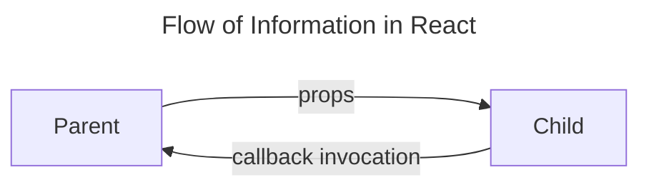

# Week-04

## Introduction

### Topics Covered

- Basic Hooks
- Events and Handlers
- Updating State

### Lesson Objectives

By the end of this lesson, we will:

> [!drafting note]
> clean up the Events and Updating State objectives - bit mixed up

#### Objective 1: Basic Hooks

- Understand the purpose of commonly used React hooks - useState, useEffect, and useRef.
- Demonstrate how to implement React hooks.

#### Objective 2: Events and Handlers

- Examine the details of passing handler props between components in React.
- Explain the purpose of the event object and how it relates to DOM events
- Examine the properties and methods found on a React event object
- Select the appropriate handler props to capture event data and manage event propagation

#### Objective 4: Updating State

- Demonstrate sending and receiving data through props to build dynamic components
- Gain a deeper understanding about how useState works
- Explore techniques to use events and the state update function to update state

## Discussion Topics

> [!note]
> Hooks, events, and updating state are extremely interconnected topics. To keep code examples from being too complicated, the first 3 sections will not build on CTD Swag. We will return to that in the final section, Updating State, where we tie everything together. Even though the examples are simplified, they will include some code that has not been covered quite yet. Everything illustrated will be covered by the end of the lesson. Where possible, the discussion highlights specific lines of code to pay attention for each example.

### Basic Hooks

A React Hook is a function that allows functional components add state, integrate with side-effects, and work with other React features. We can also develop our own custom hooks to encapsulate logic (including other hooks!) into reusable functions. Hooks were introduced in React 16.8 (released February 2019) and gave functional components access to features that were previously available to only class-based components. We won't be working with class-based components but it's important to be aware they exist since you may encounter them in older codebases.

The existing hooks can be broken down into several categories. We'll highlight the common ones.

- **state** - stores information like user input that is used to help render components
	- `useState`: keeps track of a single, updatable value
	- `useReducer`: used when there are a lot of values to track and update in a component - covered in [[Code The Dream/Intro to React V3/Curriculum/Week-11|Week-11]]
- **context** - refers to a way to share data between components without having to pass props
	- `useContext` allows a component to read and subscribe to a defined context - covered in [[Week-11]]
- **effects**
	- `useEffect`: allows us to run side effects like loading data or working with non-React page code - more in [[Code The Dream/Intro to React V3/Curriculum/Week-07|Week-07]]
- **refs** - short for "reference" - they allow us to save and work with values that persist across renders but are not used for rendering
	- `useRef`: creates a `ref` that can hold a value or commonly to access a DOM node
- **performance**: optimizes re-render performance by allowing unnecessary re-rendering to be skipped - more in [[Code The Dream/Intro to React V3/Curriculum/Week-09|Week-09]]
	- `useMemo`: caches result of an expensive calculation
	- `useCallback`: caches a function definition between re-renders
- **custom**: hooks created by the developer or imported from a 3rd party library to encapsulate re-usable logic - more in [[Code The Dream/Intro to React V3/Curriculum/Week-06|Week-06]]

Lets examine several more frequently used hooks.

#### useState

`const [state, updateState] = useState(initialState);`

We were introduced to `useState` last week to load our inventory. It's important to recall that React prefers a functional approach. In the instance of `useState`, it means that we do not update state directly. Instead we give a new value to the state update function. This function:

1. Requests React to re-render the component.
2. Replaces the old state value with the new value.

When React re-renders the component, it uses this new value.

React performs [shallow comparisons](https://monsterlessons-academy.com/posts/shallow-comparison-vs-deep-comparison-in-javascript) #placeholder/link when looking for state changes. For primitive state values (strings, numbers), updating is a straight-forward process. In the example below, each time the "Count Up" button is pushed, `setCounter` increments the counter then tells React to refresh the component, replacing the previous counter value.

```jsx
function Counter() {
	const [counter, setCounter] = useState(0);
	function updateCounter(){
		setCounter(counter + 1); //
	}
	return (
		<>
			<p>{counter}</p>
			<button type="button" onClick={updateCounter}>Count Up</button>
		</>
	)
}

```

For objects and arrays React does not look into their contents so cannot see changes to object members or array items. To properly update these state in this case, we need to create a new object or array.

The example below demonstrates how to add items to an array. The buttons use `onClick` event listeners that call `addOption`. Each button press passes a corresponding text value for the option it represents. Inside `addOption`, found on line 6, we call state update function `setTacoOptions` with a new array. Inside this array, we use spread syntax to spread in the current `tacoOptions` and add the new option.

> [!drafting note] #drafting-note
> simpler example needed

```jsx
//useState with an array

function TacoBuilder(){
	const [tacoOptions, setTacoOptions] = useState(["corn tortilla"]);
	
	function addOption(option){
		//spread operator expands tacoOptions into a new array
		setTacoOptions([...tacoOptions, option]);
	}
	
	function showSelections(){
		return tacoOptions.reduce((accumulator, currentValue, currentIndex, tacoOptions) =>{
			if( currentIndex === tacoOptions.length - 1){
				return `${accumulator}, and ${currentValue}`
			};
			return `${accumulator}, ${currentValue}`
		})
	}
	
	return (
		<>
			<div className="mains">
				<button type="button" onClick={(() => addOption("chicken"))}>Chicken</button>
				<button type="button" onClick={(() => addOption("beef"))}>Beef</button>
				<button type="button" onClick={(() => addOption("vegitarian"))}>Vegitarian</button>
			</div>
			<div className="cheeses">
				<button type="button" onClick={(() => addOption("cheddar"))}>Add Cheddar</button>
				<button type="button" onClick={(() => addOption("queso fresco"))}>Add Queso Fresco</button>
			<div>
			<div className="extras">
				<button type="button" onClick={(() => addOption("sour cream"))}>Add Sour Cream</button>
				<button type="button" onClick={(() => addOption("salsa"))}>Add Salsa</button>
			</div>
			<div>
				<p>Your taco includes: {showSelections()}</p>
			</div>
		</>
	)
}
```

Object-based state value takes a similar approach. In the example below, the `CreatUserForm` component contains two input fields that are wired to listen to changes. Each time their contents change, they call `updateFirstName` or `updateLastName`. These functions use the `value` from the event object to determine the new value.

```jsx
//useState with an object

function CreateUserForm(){

	const [userInfo, setUserInfo] = useState({firstName : "", lastName  : ""})

	function handleSubmit(event){
		//logic to handle form submission
	}
	function updateFirstName(event){
		//more on the event object later this lesson...
		//pulling the first name out of the event object
		const firstName = event.target.value;
		setUserInfo({firstName: firstName, lastName: userInfo.lastName})
	}
	function updateLastName(event){
		//pulling the last name out of the event object
		const lastName = event.target.value;
		setUserInfo({firstName: userInfo.firstName, lastName: lastName})
	}
	return(
		//more on forms in 
		<form submit={handleSubmit}>
			<label>First Name
				<input onChange={updateFirstName}
			</label>
			<label>Last Name
				<input onChange={updateLastName}
			</label>
		</form>
	)
}
```

Other things to know about the state value:

 - It's private - unless it's is passed through props, a state value can only be referenced in the component where it's defined.
 - We don't need to worry about using too many `useState`s. React batches state updates together to keep the render cycle efficient.

#### useEffect

`useEffect(setup, dependencies?)`

> [!note]
> A question mark (on `dependencies?`) is a common way to indicate an argument is optional

The `useEffect` hook allows us to synchronize a component with data found outside the application. This could be an API request, accessing local storage, managing a non-React feature on the same page, or any other scenario where we need to "step outside" of React. This hook takes two arguments: a setup function, and an optional dependency array.

The setup function contains logic needed for the effect and optionally returns a cleanup function. A cleanup function is used to for any necessary cleanup tasks before the component unmounts or before the effect is re-run. This can include clearing timers, unsubscribing from subscriptions, or any other clean-up activities to prevent memory leaks or unexpected behavior in a React component.

The dependency array is an optional list of props, state, and variables and functions defined directly in the component. After a component renders, if any of these have changed, React re-runs the `useEffect`. If this array is empty, the effect is ran only after the initial render. It will not do anything on subsequent re-renders. If the dependency array is omitted, the `useEffect` runs after first render and after each subsequent re-render.

For the example below, we've implemented another counter component. Each time the button is clicked, it updates count. After the component re-renders, React looks at the useEffect's dependencies - if any of the dependencies have changed, it will then re-run the effect. In this case, each time the component re-renders, the `useEffect` logs out a message and the `count` value to the console.

```jsx
//useEffect with dependency array

function AnotherCounter() {
  const [count, setCount] = useState(0);

  useEffect(() => {
    // This code will run when the component first loads
    // and each time `count` changes
    if(count === 0 ){
	    console.log(`Count has started at: ${count}`);
    } else {
	    console.log(`Count has changed to: ${count}`);
    };
  }, [count]);

  return (
    <>
      <button onClick={() => setCount(count + 1)}>Increment Count</button>
      <p>Count: {count} </p>
    </>
  );
};
```

In `WebSocketComponent` below, we use the `useEffect` to create a new web socket connection after the component first renders. The connection remains intact during subsequent re-renders of the component. The `useEffect` returns a cleanup function that disconnects the component from the web socket when the component is removed from the DOM. If this step was not included, the web socket connection would remain open and would not close until the application was closed out or the page manually refreshed.

```jsx
//useEffect with depencency array and cleanup function

function WebSocketComponent {

  useEffect(() => {
    const socket = new WebSocket('sockets://example.com/socket');
    
    socket.onopen = () => {
      console.log('WebSocket connection opened');
    };

    socket.onclose = () => {
      console.log('WebSocket connection closed');
    };

    return () => {
      console.log('Cleanup - Closing WebSocket connection');
      socket.close();
    };
  }, []);

  return <div>WebSocket Component</div>;
};
```

The `useEffect` in the example logs a message to the console when the component first renders. It does nothing else on subsequent re-renders.

```jsx
//useEffect with empty depencency array
const ExampleComponent = () => {
  useEffect(() => {
    console.log('Component mounted');
  }, []);

  return <div>Example Component</div>;
};
```

In the final example, the `useEffect` logs a message to the console on the initial render and after each re-render.

```jsx
//useEffect with no depencency array
const ExampleComponent = () => {
  useEffect(() => {
    console.log('Effect without dependencies - runs on every render');
  });

  return <div>Example Component</div>;
};
```

#### useRef

`const ref = useRef(intialValue)`

`useRef` is a React Hook that returns an object whose `current` property is initialized with the provided value. The ref's `current` property can be used to hold a value that we can change but remains intact across component re-renders. A change a ref does not trigger a component re-render. `useRef` is commonly used to access DOM nodes and managing focus on input fields.

In the following example, we store a reference to the page title and then use useEffect to keep it updated with the latest `count` value.

```jsx
//useRef used in conjunction with useEffect to update a page title

function PageTitleUpdatingCounter() {
  const [count, setCount] = useState(0);
  const title = useRef(document.querySelector('title');

  useEffect(() => {
    // This code will run when the component first loads
    // and each time `count` changes
    title.current.text = `Times pressed: ${count}`
  }, [count]);

  return (
    <div>
      <button onClick={() => setCount(count + 1)}>Increment Count</button>
    </div>
  );
};

```

Using `useRef` comes with a few rules.

1. This value can be updated during initialization but should never be read or written during the re-render cycle. This means that we should only be working with it in other hooks or functions defined in the component. Changing or reading the value at the top level of the component after the first render leads to unpredictable behavior:

```jsx
//do NOT do this:
function BadComponent(){
	const someValue = useRef("foo");
	someValue.current = "bar"; //accessing or changing here can lead to problems
	//rest of the component code...
}
```

Updating the value during initialization is alright so long as the initial value is predictable.

```jsx
//this is OK
function ExampleComponent(){
	const title = useRef(null);
	if(title.current === null){
		title.current = document.querySelector('title');
	};
	//rest of the component code...
}
```

1. Don't use it in the component's return body. These values are not meant for rendering and DOM references cannot be accessed outside of the component without additional tools. [`forwardRef`](https://react.dev/reference/react/forwardRef) helps with this but is an advanced topic so we will not be covering it in this course.

With hooks like useState, useEffect, and useRef, React developers can handle component state, side effects, and manage DOM elements outside the application. Understanding hooks is fundamental in modern React development and essential for building scalable and efficient applications. These are just a few hooks available and we will add new hooks to our toolkit as the weeks continue. We still have events to cover so let's keep on moving…

### Events and Handlers

#### Child Component to Parent Component Communication

Last week we discussed how props are used to communicate in a component tree from parent components down to their children. The data passed is used to configure a component's appearance when it renders but this does not solve the challenge of managing state across an application. Recall that props are read-only and can only be changed with the state update function provided by `useState`.

We cannot pass props up the component tree (child to parent), but we can take advantage of functions passed through props to communicate back to the parent. A function, when it is used this way, is referred to as a "callback" or a handler function. We can use state update functions as callbacks or we can define our own. When we invoke the callback in our child component, we are communicating that a state update needs to be processed. Depending on the the type of state being update, we can include a new value or allow the callback to determine what that new value needs to be.



#### Synthetic Events

Browsers emit objects called events that signal when things happen on a web page. This gives developers information about the event so that they can program behavior around it. React introduces a concept of a *React event object*, more frequently known as a *synthetic event*, which is very similar to a browser's *event object*. In fact, a synthetic event is just a wrapper around a normal event object with the main goal of having consistent event APIs across all the different browsers.

[React's documentation](https://react.dev/reference/react-dom/components/common#react-event-object) includes a full list of common properties and methods on the synthetic event. A few are worth mentioning because we will see them frequently:

- properties
	- **`currentTarget`**: DOM node where the event handler has been is attached.
	- **`target`**: DOM node where event was triggered - this could be anywhere in the tree at or below the Component that is reading this property due to [event bubbling](https://developer.mozilla.org/en-US/docs/Learn/JavaScript/Building_blocks/Event_bubbling).
- methods
	- **`preventDefault()`**: Prevents the default browser action on the event. eg: preventing a page refresh from a form submission.
	- **`stopPropogation()`**: Stops the event from bubbling up the React tree.

#### Handler Props

React includes an [exhaustive list](https://react.dev/reference/react-dom/components/common#common-props) of built in handler props that we can add to our components. Each one is designed to take a callback function and pass it a synthetic event that it can optionally consume. React adds additional properties to the synthetic event relevant to the event type whenever the listener is triggered. All of these event-based handler props have a prefix `on`, as in `onClick`, `onChange`, etc. Since there are 14 event types, we have to prioritize learning event types and props that relate to our project. We can save the other event types less common handler props for future exploration.

- `MouseEvent` - events that involve mouse navigation
	- example handlers: `onClick`, `onMouseEnter`, `onMouseOver`, and `onMouseLeave`
	- properties added to the synthetic event: which button is pushed, keyboard modifiers, cursor location, cursor movement
- `TouchEvent` - events from interacting with screen interfaces like cell-phones or tablets.
	- `onTouchStart`, `onTouchMove`, `onTouchEnd`, `onTouchCancel`
	- properties added to the synthetic event: keyboard modifiers, touches, and targets of touches
- `InputEvent` - events involving editable inputs such as check boxes, text fields, text-areas etc.
	- `onChange`, `onSelect`
	- properties added to the synthetic event: keyboard modifiers

### Updating State

#### Handler Composition Options

React provides a great deal of flexibility when it comes to composing handler props and handler/callback functions in our applications. Creating a custom callback in the parent or the child are equally acceptable. To help with readability, it is common to prefix a custom function's name with "handle", as in `handleClick`, `handleUpdatePassword`, or `handleAddItemToCart`. This approach lets us know that data related to an event is being *handled*. The example below transforms a email address to all lowercase letters before it is passed to `setEmail`. It also prevents the default form behavior which is to trigger a page refresh.

```jsx
//setEmail is a state update function provided as a callback by the parent component
function EmailInput({setEmail})(
	const emailInput = useRef();

	function handleSubmit(){
		//prevents page refresh
		event.preventDefault();
		const lowerCaseEmail = emailInput.current.value.toLowerCase();
		updateEmail(lowerCaseEmail);
	}
	return (
		<form onSubmit={handleSubmit}>
			<label>
				User Name:
				{/*assigning ref selects the element on the page*/}
				<input type="text" ref={userNameInput}/>
			</label>
			<button/>
		</form>
	)
)
```

In the example below, we've created 2 custom callbacks, `increment` and `decrement` and then pass them each to an instance of a `Button` component. When clicked, `onClick` invokes the callback which uses `setCount` to update state with the appropriate value.

```jsx
//Parent component using custom callbacks on 2 buttons

function YetAnotherCounter(){
	const [count, setCount] = useState(0);

	function increment(){
		setCount(count + 1);
	}
	function decrement(){
		setCount(count -1);
	}
	return (
	<>
		<Button updateCount={increment} text={"increase"}/>
		<Button updateCount={decrement} text={"decrease"}/>
		<p>Counter: {count}</p>
	</>
  );
	)
}
//each instance of Button above behaves differently because it was given a different callback
function Button({updateCount, text}){
	return (
		<button type="button" onClick={updateCount}>{text}</button>
	)
}
```

We can even add an inline arrow function on a handler props directly.

```jsx
//inline arrow function

function Counter() {
  const [count, setCount] = useState(0);
  return (
    <div>
      <button onClick={() => setCount(count + 1)}>Increment Count</button>
      <p>Button pressed {count} times.</p>
    </div>
  );
};

```

#### Putting it all Together

We're not quite ready to do any more with the inventory but the store is missing a key feature: a shopping cart! Let's fix up the styling to make it look more like a storefront and then implement a cart.


## Weekly Assignment Instructions

### Expected App Capabilities

> [!drafting note]
> We will be adding localStorage as a caching mechanism. Remember to remove this feature when we introduce API usage in Week 7. We're not touching the concept of synchronizing them and they are just different ways of persisting data.

After completing this week's assignment, the app should be able to:

- capability 1
- capability 2
- capability n

### Instructions Part 1

 1. [ ] step 1
 2. [ ] step 2
 3. [ ] step n

### Instructions Part 2

 1. [ ] step 1
 2. [ ] step 2
 3. [ ] step n

### Instructions Part n

 1. [ ] step 1
 2. [ ] step 2
 3. [ ] step n

## References and Further Reading

### Basic Hooks

- [Built-in Hooks (React docs)](https://react.dev/reference/react/hooks)
- [Mastering React Hooks: A Comprehensive Guide with Examples (dev.to)](https://dev.to/jaingurdeep/mastering-react-hooks-a-comprehensive-guide-with-examples-3e3b)
- [React Hooks Cheatsheet](https://react-hooks-cheatsheet.com/)

### Passing Props

- [Passing Props to a Component (React docs)](https://react.dev/learn/passing-props-to-a-component)

### Events

- [Responding to Events (React docs)](https://react.dev/learn/responding-to-events)
- [How to Handle Events in React (freeCodeCamp)](https://www.freecodecamp.org/news/how-to-handle-events-in-react-19/)
- [Common Components - React Event Object (React docs)](https://react.dev/reference/react-dom/components/common#react-event-object)

### Updating State

- [Updating Objects in State (React docs)](https://react.dev/learn/updating-objects-in-state)
- [useState (React docs)](https://react.dev/reference/react/useState)
