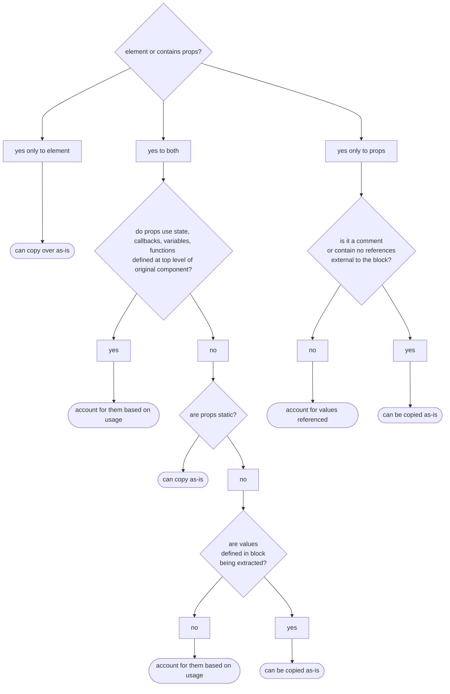

# Week-06

> [!drafting note] #drafting-note
> we expose the students to a repo with pre-written tests and some code errors to address rather than have students write their own.
>
> 1. submission #1 - code updates to refactor project
> 2. submission #2 - diagnose 3-4 failed tests, stretch goal: write test for a component

## Introduction

> [!note]
> This week will contain 2 submissions. One will be continued work on the todo list and the other will be a cloned repo where you work through some failed tests. More info detailed in the weekly assignment instructions.

### Topics Covered

- Reusable Components
- Project Organization
- Refactoring
- Testing

### Lesson Objectives

By the end of this lesson, we will:

#### Objective 1: Reusable Components

> [!drafting note] #drafting-note
> Take advantage of the variants property: phones have models, shirts, hats, jackets have different colors
> This may be a good way to deal with optional props with default values

- Discuss the value of reusable components and how they foster efficiency, scalability, and consistency in React development
- Implement reusable components that can be shared across an application

#### Objective 2: Organizing Files in a React Project

- Discuss essential methodologies for effective file organization in a React project
- Formulate an approach to organize our project

#### Objective 3: Refactoring a Project for Expansion

- Examine how refactoring out portions of an existing component into re-usable components improves code organization and readability
- Demonstrate the process of extracting logic and elements from components to craft sub-components

#### Objective 4: Testing React Components

- Discuss the fundamental importance of testing to ensure functionality, robustness, and stability in React components
- Compare various testing methodologies like unit testing, integration testing, and end-to-end testing
- Use Jest and the React Testing Library to test React components and troubleshoot bugs

## Discussion Topics

### Reusable Components

Components are one of the fundamental building blocks of any React application. One of their main strengths is reusability. By writing components once and instantiating them as needed, we can streamline development and improve code maintainability.

Certain elements in a UI tend to repeat themselves. These repeated elements might look same but contain different content. Conversely, they may have slightly different appearances but are structurally similar. These include:

- article excerpts on a blog's home page
- product cards
- list items
- day boxes in a calendar

We have already seen a few examples of repeated elements in CTD Swag. The blurred out product cards and the shopping cart items are both elements that repeat themselves. In fact, we've already had some experience with the card components.

![[202411_0415PM-Firefox Developer Edition.png|400]]

The shopping cart items are a prime example of an element that can be turned into a re-usable component. Inside of the `Cart` component, we map over the `workingCart` to create each list item. Rather than housing the code in `Cart` component, it can be extracted out to a `CartItem` component. Doing so saves space in the existing component file plus make it easier to read.

> [!drafting note] #drafting-note
> refactor out CartItem

```jsx
//extract from Cart.jsx

{workingCart.map((item) => {
	return (
		<li className="cartListItem" key={item.id}>
			
			<h2>{item.name}</h2>
			<div className="cartListItemSubtotal">
				<label>
					Count:{' '}
					<input
						type="number"
						value={item.itemCount}
						onChange={(event) => handleUpdateField({ event, id: item.id })}
					/>
				</label>
				<p>
					Subtotal: $
					{(item.price * item.itemCount).toFixed(2) || '0.00'}
				</p>
			</div>
		</li>
	);
})}
```

Another category of reusable components are elements that are used throughout an interface that allow user to navigate or interact with the page. They can also be visual details that unify the look and feel of an interface. Such components could include:

- buttons
- tooltips
- dialog boxes
- navigation menus
- forms

Any visual element is a candidate to become a reusable component as long as 2 criteria are met. 1.) They accept the same props and 2.) they have the same underlying structure. If we also take advantage of default props values and children props, we can further increase opportunities for creating re-usable components. Lets examine a `Dialog` component to see how we can make it into a flexible, reusable component.

Dialog boxes convey messages to users based on their actions, such as success messages, error notifications, or warnings, or general information the user may need. A typical dialog box consists of its container, a heading, message, and one or more buttons to take an action on the message.

![[202411_1134AM-Firefox Developer Edition.png|300]]

Below is the equivalent code, excluding styles to neaten up the dialog's appearance.

```jsx
//Dialog.jsx

import info from './assets/info.svg';

export function Dialog() {

  return (
    <div className="dialog">
      <div className="heading">
        <p>INFO dialog</p>
        <div className="icon">
          
        </div>
      </div>
      <div className="content">
        Lorem, ipsum dolor sit amet consectetur adipisicing elit. Possimus
        exercitationem quos quam, nihil cum voluptates tempore enim! Vel,
        provident adipisci quos, similique iusto repellendus culpa obcaecati
        libero, nostrum reiciendis quidem.
      </div>
      <div className="controls">
        <button>Okay</button>
      </div>
    </div>
  );
}

```

We can categorize the information that we provide into one of several categories: **info**, **success**, **error**, or **warning**. Each one of these are commonly associated with colors and icons to help convey the message's tone to the user. Adding these to our dialog could help our user better understand the information that we are trying to convey.

- success: green, ✔️ (check mark)
- error: red, ❌ (cross mark - not to be confused with x or X)
- warning: yellow, ⚠️ (warning)
- info: no color or blue, ℹ️ (information)

> [!accessibility note]
> Do not rely on color alone! [Around 300 million people](https://my.clevelandclinic.org/health/diseases/11604-color-blindness) throughout the world have some form of color blindness. This is why it's important to also include an icon when using any sort of color coding. More information about common color accessibility issues can be found on [deque's website](https://www.deque.com/blog/3-common-color-accessibility-issues-one-can-easily-avoid/). They are a maker of a popular suite of accessibility tools.

The first step in making `Dialog` component extensible is to add a `kind` prop to the Dialog's definition. We'll set it do a default value of "info" since that's the most generic category. We can then use that prop to configure the rest of the component.

- import images for each category and create an image lookup object
- create a background-color lookup object
- add in a background style for the dialog's heading
- update the image's src using the props and image lookup object

Our updated `Dialog` component code now looks like:

```jsx
//Dialog.jsx
import error from './assets/error.svg';
import info from './assets/info.svg';
import success from './assets/success.svg';
import warning from './assets/warning.svg';

export function Dialog({ kind = 'info' }) {
  const images = {
    error,
    info,
    success,
    warning,
  };

  const colors = {
    error: '#f6bed7',
    info: '#bec7f6',
    success: '#bef6c5',
    warning: '#f6eebc',
  };

	return (
		<div className="dialog">
			<div className="heading" style={{ backgroundColor: colors[kind] }}>
				<p>{kind.toUpperCase()} dialog</p>
				<div className="icon">
					
				</div>
			</div>
			<div className="content">
				Lorem, ipsum dolor sit amet consectetur adipisicing elit. Possimus
				exercitationem quos quam, nihil cum voluptates tempore enim! Vel,
				provident adipisci quos, similique iusto repellendus culpa obcaecati
				libero, nostrum reiciendis quidem.
			</div>
			<div className="controls">
				<button>Okay</button>
				<button>Dismiss</button>
			</div>
		</div>
	);
  
}

```

All that is left to do is to pass a `kind` props into the instance of `Dialog` component and then add buttons that will let us toggle between the dialogs.

```jsx
//App.jsx
import { useState } from 'react';
import { Dialog } from './Dialog';

const dialogKind = {
  error: 'error',
  info: 'info',
  success: 'success',
  warning: 'warning',
};

function App() {
  const [kind, setKind] = useState(dialogKind.info);
  return (
    <>
      <main>
        <Dialog kind={kind} />
        <div className="buttonWrapper">
          <button onClick={() => setKind(dialogKind.error)}>Error</button>
          <button onClick={() => setKind(dialogKind.info)}>Info</button>
          <button onClick={() => setKind(dialogKind.success)}>Success</button>
          <button onClick={() => setKind(dialogKind.warning)}>Warning</button>
        </div>
      </main>
    </>
  );
}

export default App;
```

![[202411_0656PM-Firefox Developer Edition.gif|400]]

The dialog has a default `kind` and when changed, it displays a different color and a helpful icon in its heading. Suppose that we have messages that come from an API response that we wanted to include them instead of the static paragraph we currently had. We have two options with this approach - we can add a `message` props or we can pass the message into the instance using the special `children` props. Using the `children` approach has the added advantage that we can further format the message or include other jsx.

To do this, we'll add a `children` props to `Dialog` component's definition and replace the paragraph of lorem ipsum text with `{children}`. This acts as an outlet for any jsx nested in between the component instance's tags.

```jsx
//excerpts from Dialog.jsx
export function Dialog({ children, kind = 'info' }) {export function Dialog({ children, kind = 'info' }) {
//component code...
	return (
	    <div className="dialog">
	      <div className="heading" style={{ backgroundColor: colors[kind] }}>
	        <p>{kind.toUpperCase()} dialog</p>
	        <div className="icon">
	          
	        </div>
	      </div>
	      <div className="content">{children}</div> {/*displays content placed between Dialog tags*/}
	      <div className="controls">
	        <button>Okay</button>
	        <button>Dismiss</button>
	      </div>
	    </div>
	);
}
```

```jsx
//excerpts from App.jsx
function App() {

  const [kind, setKind] = useState(dialogKind.info);
  
  return (
    <>
      <main>
        <Dialog kind={kind}>
          {/*using curly brackets as text inside of jsx will confuse the compiler*/}
          {/*&#123; and &#125 are html character codes for { and }, respectively*/}
          <h2>Flexibility of children props</h2>
          <p>
            Anything that is placed here shows up in the document structure
            where the &#123;children&#125; props was placed inside the
            `.content` div of the Dialog component.
          </p>
        </Dialog>
        <div className="buttonWrapper">
          <button onClick={() => setKind(dialogKind.error)}>Error</button>
          <button onClick={() => setKind(dialogKind.info)}>Info</button>
          <button onClick={() => setKind(dialogKind.success)}>Success</button>
          <button onClick={() => setKind(dialogKind.warning)}>Warning</button>
        </div>
      </main>
    </>
  );
}
```

![[202411_0516PM-Firefox Developer Edition.png|300]]

### Organizing Files in a React Project

We inevitably add more components and sometimes refactor out non-React code into its own file as a project grows. If we maintain a flat file structure - *everything is in `src/` and `src/assets/` in our case* - the project becomes increasingly disorganized which makes it to be harder to find things or figure out how components relate to each other. In this section, we will discuss some considerations that go into determining the directory structure and organizing files for CTD Swag so we can continue to add functionality.

> [!note]
> The internet hosts many discussions and even more opinions about how to structure software projects. What we provide is a sensible approach that works well with small to medium React projects. Some larger projects require structures tailored to the problems that they solve and features they implement. Other React projects using frameworks such as Next.js, Astro, Remix must adhere to rules prescribed by the framework since they tend to use specific directories for features such as page routing or asset management.

#### Details to Consider

Before we start reorganizing our project, we ask the following questions about each file or code passage as we review the project's contents:

- **What feature(s) does it support?** In the context of organizing a React project, a "feature" typically refers to a distinct and self-contained functionality or section of the application that serves a specific purpose. If a component supports multiple features, it's considered shared.
	- CTD Swag currently has 2 features: a list of items for sale and a checkout cart. This list will grow as we add more functionality.
	- The `ProductCard` is already componentized and is used inside of the list of items for sale. Since it is only meant for use with the cart, we group it with feature code related to `ProductList`.
	- Another portion of feature-related code is the checkout item - the elements that it uses have not been converted into component but will be as we refactor the project this week. Since it's only is found in a single feature, we'll group it with code related to `Cart`.
- **Does a component serve mostly as a layout structure or help organize the UI?** For example, is it a heading, footer, a sidebar, or help contain the main content of the app?
	- CTD Swag already includes a Header component and we will refactor out the footer into its own component this week.
- **Is it reused or does the same code show up in multiple places?**
	- Buttons, forms, and other reusable elements we discussed earlier should be considered here. We do not have any at this time but we can be assured that we will develop some so we can create a placeholder for them in the structure.
- **Does it help us work with a 3rd party library, data retrieval, or storage?**
	- This is not a question that we are ready to answer for CTD Swag. We don't implement any other libraries but we will eventually need a payment processing system. Processors such as Stripe, PayPal, or ApplePay provide developers with a software development kit (SDK) which include necessary resources to work with their platforms. We also don't implement LocalStorage, IndexedDB, or any APIs yet but will in future lessons. We can make a placeholder for these so we remember where they go.
- **Is it a helper utility that can function independently from React?**
	- `getCartPrice` in the Cart component is a function that tallies up the cost of each item in the cart. It doesn't rely on any React code. We could turn it into helper utility since we may use it again during the checkout process we build later. For now, it will remain in place since we can take care of that refactor when we build the checkout feature. The same rationale applies to `getItemCount` in Header.

Answers for each of these questions help us determine how to group aspects of the codebase. We end up with an anticipated project structure that resembles the following:

```terminal
.
├── node_modules/
├── public/
	└── .gitkeep
├── src/
    ├── assets/
	    ├── fonts/
	    ├── icons/
	    ├── catalog.json
	    └── product images
    ├── features/
	    ├── ProductList/
			├── ProductList.jsx
			└── ProductCard.jsx
	    └── Cart/
			├── Cart.jsx
	        └── CartItem.jsx (new component)
    ├── services/
	    └── .gitkeep
	├── shared/
	    └── .gitkeep
    └── layout/
	    ├── Footer.jsx (new component)
	    └── Header.jsx
├── .eslint.cjs
├── .gitignore
├── .prettierignore
├── .prettierrc
├── index.html
├── package-lock.json
├── package.json
├── README.md
└── vite.config.js

```

The outline below provides a few more notes on the directories.

- **assets/** - static resources such as fonts and images used for the UI
	- product images and catalog.json are for placeholder data until we establish an API to manage a live inventory
- **features/** - components grouped by functionality
	- if a feature does not need sub-components, its primary component can be placed directly in this folder
	- when features are refactored into sub-components, a folder of the same name as the feature is added to store all related files
	- any component used by multiple features gets moved to `shared/`
- **services/** - non-React functionality extracted from components
	- **.gitkeep**[^gitkeep] - placeholder file
- **shared/** - re-usable components that are used in more than one feature
	- **.gitkeep** - placeholder file
- **layout/** - components used to help organize and divide the UI into manageable pieces

### Refactoring a Project for Expansion

#### Create Directories and Organize Existing Files

To start the refactor, we create the new directories and move existing files into their updated location. As each file is moved, it's important to make sure that import statements are updated - both inside the file as well as wherever it is being imported. Running the dev server provides in-browser errors that are handy at letting us know where file imports are incorrect.


![[202411_1148AM-Firefox Developer Edition.png|600]]

VS Code is helpful in making some of these updates automatically as we move around files too. Be careful to double-check the imports in the file being moved - VS Code may not recognize non-JavaScript imports. Being able to import images and other non-JavaScript files is a feature of Vite and is not a part of [JavaScript module syntax](https://developer.mozilla.org/en-US/docs/Web/JavaScript/Guide/Modules).

![[202411_0250PM-Code.png|400]]

#### Refactoring Out Components

After the files have been moved into place, we need to refactor out the footer and the cart's item card. To determine how to refactor the footer into a component, we first must look at the elements that make up the footer.

```jsx
//extract from App.jsx
//component code...
const year = useRef(
    (() => {
      const now = new Date(Date.now());
      return now.getFullYear();
    })()
  );
//component code...
<footer>
	<p>
	  Made with ❤️ | &copy; {year.current}{' '}
		<a href="https://codethedream.org/">CTD </a>
	</p>
</footer>
```

The footer consists of a single html element, `<footer></footer>` that contains a few nested elements and text that uses a `ref`. We copy the footer and `useRef` over to a new file for the `Footer` component. This new file resides in `/src/layouts` since it's a portion of the UI and is named Footer.jsx.

```jsx
//layout/Footer.jsx
import { useRef } from 'react';

export default function Footer() {
  const year = useRef(
    (() => {
      const now = new Date(Date.now());
      return now.getFullYear();
    })()
  );
  return (
    <footer>
      <p>
        Made with ❤️ | &copy; {year.current}{' '}
        <a href="https://codethedream.org/">CTD </a>
      </p>
    </footer>
  );
}

```

After saving the file, we need to import the `Footer` into `App` and then replace the html footer element and its contents with a self-terminating `<Footer />` tag. Once complete, everything in the browser page should look the same.

```jsx
// return statement from App.jsx

return (
    <>
      <Header cart={cart} handleOpenCart={handleOpenCart} />
      <main>
        <ProductList
          inventory={inventory}
          handleAddItemToCart={handleAddItemToCart}
        ></ProductList>
        {isCartOpen && (
          <Cart
            cart={cart}
            setCart={setCart}
            handleCloseCart={handleCloseCart}
          />
        )}
      </main>
      <Footer /> {/*this replaces <footer>...</footer> */}
    </>
  );
```

Our next task is to extract the cart's product item into `ProductItemCard`. We create a file co-located with Cart.jsx inside the Cart directory and then examine the JSX of cart we need to extract:

```jsx
//Cart/Cart/jsx
{/* ...component code */}
      <div className="cartListWrapper">
        {workingCart.length === 0 ? (
          <p>cart is empty</p>
        ) : (
          <form>
            <ul className="cartList">
              {workingCart.map((item) => {
	              {/**********START HERE*********/}
                return (
                  <li className="cartListItem" key={item.id}>
                    
                    <h2>{item.name}</h2>
                    <div className="cartListItemSubtotal">
                      <label>
                        Count:{' '}
                        <input
                          type="number"
                          value={item.itemCount}
                          onChange={(event) =>
                            handleUpdateField({ event, id: item.id })
                          }
                        />
                      </label>
                      <p>
                        Subtotal: $
                        {(item.price * item.itemCount).toFixed(2) || '0.00'}
                      </p>
                    </div>
                  </li>
                );
	            {/**********END HERE************/}
              })}
            </ul>
            
{/* ...component code */}
```

We have a lot more code to work with than with the Footer component so we need to take an inventory if the details we need to account for during the conversion. Using a decision tree is an invaluable analytic technique that helps you recall everything that needs to be considered while extracting components. We follow a multi-step decision tree as we look over each passage in the code. Each response includes a conclusion we can make or some detail(s) to consider further.



For those who prefer a text-based approach, the following is a bulleted outline of the diagram above:

- Is it an *element tag* and does it contain any *props*?
	- **yes to element, no to props**: we can copy it as-is
	- **yes to element, yes to props**
		- does the *props* reference any *state* or *callbacks*, *variables*, or *functions* defined in the top level of the component?
			- **no**: are props **static**?
					- **yes**: the element can be copied as-is
					- **no**: are all the values defined in a block contained in the element being extracted to a new component?
						- **yes**: the element can be copied with the block as-is
						- **no**: we need to account for them based on their usage in the application
			- **yes**: we need to account for them based on their usage in the application
	- **no to element**: is it a *comment* or a self-contained block that *does not reference* anything outside of the JSX being extracted?
		- **yes**: it can be copied as-is
		- **no**: we need to account for any props, variables, or functions referenced and how they're being used

> [!note]
> These questions are a good foundation for thinking about refactoring out a component. There may be times that the code context does not fit neatly into this decision tree. As developers, we solve problems and update our practices as we gain experience. How you examine code passages grow and change as you continue to work with React and gain better a understanding of it and its companion technologies.

We examine the JSX and go through the decision tree we to come up with the following considerations:

1. **`.map`**: outside of `CartItem` but creates `item`. `item` will need to be passed into `CartItem` as props
2. **`<li>` opening tag**: `className` is a static value. `key` is a special props that allows React to track component instances and is not added to `CartItem`'s function definition. We will end up adding it to the `CartItem` instance.
3. **list item's contents**
	1. **``**: uses an image imported in by the `Cart` component. We will move the import with the refactor since it's not used anywhere else.
	2. **`<h2>`**: references `item` which will be in `CartItem`'s props so can be copied as-is.
	3. **`<div>`**: `className` is a static value but contains sub-elements to examine
		1. **`<input>`**: references `item` and uses a handler function for field updates - need to pass the handler as props into `CartItem`
		2. **`<p>`**: references `item` which will be in `CartItem`'s props so can be copied as-is.

For ease of reference, the image below highlights the considerations listed above:

![[202411_1056AM-Obsidian.png|500]]

With these considerations identified, we can finally plan our refactor to extract `CartItem`. We must first create the new file inside `src/features/cart` and define the `CartItem` component. We include `{item}` in the arguments so that we have it to work with. We next copy over (don't remove it yet) the entire list item into `CartItem's` return statement. We also move over the image import. Remove the `key` props from the list item - it's not needed any more. To deal with the handler function we add `onHandleItemUpdate` to `CartItem`'s arguments.

We have a completed `CartItem` component ready for use. As you can see, most of the code extracted remains the same. Only the `key` is removed and the input's handler function name changes.

```jsx
// src/features/Cart/CartItem.jsx
import placeholder from '../../assets/placeholder.png';

function CartItem({ item, onHandleItemUpdate }) {
  return (
    <li className="cartListItem"> //key removed since no longer used here
      
      <h2>{item.name}</h2>
      <div className="cartListItemSubtotal">
        <label>
          Count:{' '}
          <input
            type="number"
            value={item.itemCount}
            onChange={(event) => onHandleItemUpdate({ event, id: item.id })} //handler name updated
          />
        </label>
        <p>Subtotal: ${(item.price * item.itemCount).toFixed(2) || '0.00'}</p>
      </div>
    </li>
  );
}

export default CartItem;
```

Over in the `Cart` component we import `CartItem` and replace the list item with and instance of `CartItem`. We next pass in `item` to the `item` props, `item.id` to the key props, and `handleUpdateField` to `onHandleItemUpdate`.

```jsx
//extract from Cart.jsx

{workingCart.map((item) => {
	return (
		<CartItem
			key={item.id}
			item={item}
			onHandleItemUpdate={handleUpdateField}
		/>
	);
})}
```

All of these changes should result in an interface that continues to look and behave just the same. However, our code is now organized better and it's easer to read the code in `App` and `Cart` components.

### Testing React Components

Testing Best Practices with React:
- Use Testing Frameworks: Utilize testing frameworks like Jest and testing libraries like React Testing Library or Enzyme for writing unit tests and integration tests.
- Write Small, Focused Tests: Create small, focused test cases that verify specific behaviors or functionalities of individual components or functions.
- Test Component Rendering: Ensure components render correctly by testing for the presence of expected UI elements, texts, and props.
- Mock Dependencies: Mock external dependencies, APIs, or modules to isolate the component being tested and simulate different scenarios.
- Utilize Snapshot Testing: Use snapshot testing to capture snapshots of component renders and compare them to detect unexpected changes in the UI.
- Test State Changes: Verify that state changes and updates trigger re-renders and reflect the expected changes in the component.
- Test Component Interactions: Test user interactions, such as user input handling, button clicks, form submissions, and validate the component behavior accordingly.
- Use Test Coverage Reports: Monitor test coverage metrics to ensure that critical parts of the codebase are adequately tested.
- CI/CD Integration: Integrate testing into Continuous Integration/Continuous Deployment pipelines to automate test runs and catch issues early in the development process.
- Refactor and Maintain Tests: Regularly refactor and maintain test suites to keep them up-to-date with code changes and ensure test reliability.

> [!drafting note] #drafting-note
> This section NEEDS attention
> App for testing: tic-tac-toe
>
> [React Testing Library Tutorial (Robin Wieruch)](https://www.robinwieruch.de/react-testing-library/)
> What tools do we need
> - Jest (optionally [Vitest](https://www.robinwieruch.de/vitest-react-testing-library/))
> - React Testing Library (replacement for Enzyme)

- purpose of testing
- types of testing methodologies
	- unit - individual parts in isolation
	- integration - ensure components work together as a group or as a larger feature
	- end-to-end - tests that run across an entire stack that replicate user tasks to ensure functioning
- testing in React - focus on unit and integration tests
	- ensure rendering under different conditions
	- uses, updates state correctly
	- handles events correctly
	- not every function or component needs a test
	- test for functionality, not implementation
		- Testing Library reenforces this by working with DOM nodes, not component instances
- steps to testing
	1. install & configure test tools
	2. determine what to test
	3. write test
	4. run
	5. examine the output

## Weekly Assignment Instructions

### Expected App Capabilities

After completing this week's assignment, the app should be able to:

- capability 1
- capability 2
- capability n

### Instructions Part 1

 1. [ ] step 1
 2. [ ] step 2
 3. [ ] step n

### Instructions Part 2

 1. [ ] step 1
 2. [ ] step 2
 3. [ ] step n

### Instructions Part n

 1. [ ] step 1
 2. [ ] step 2
 3. [ ] step n

## References and Further Reading

### Reusable Components

- [Importing and Exporting Components (React docs)](https://react.dev/learn/importing-and-exporting-components)
- [How to build Reusable React Components (freeCodeCamp)](https://www.freecodecamp.org/news/how-to-build-reusable-react-components/)

### Refactoring

- [Common Sense Refactoring of a Messy React Component](https://alexkondov.com/refactoring-a-messy-react-component/)
- [Choosing the State Structure (React docs)](https://react.dev/learn/choosing-the-state-structure)
- [Don't repeat yourself (Wikipedia)](https://en.wikipedia.org/wiki/Don%27t_repeat_yourself)

### Project Organization

- [How To Structure React Projects From Beginner To Advanced](https://blog.webdevsimplified.com/2022-07/react-folder-structure/)
- [A Better Way to Structure React Projects (freeCodeCamp)](https://www.freecodecamp.org/news/a-better-way-to-structure-react-projects/)
- [vitejs/awesome-vite: A curated list of awesome things related to Vite.js (GitHub)](https://github.com/vitejs/awesome-vite#plugins)
- [HTTP caching - Cache Busting (MDN)](https://developer.mozilla.org/en-US/docs/Web/HTTP/Caching#cache_busting)

### Testing React Components

- [React Testing Library Tutorial (Robin Wieruch)](https://www.robinwieruch.de/react-testing-library/)

[^gitkeep]: Git does not track empty directories. Empty directories are retained on the local machine but are not pushed. They will not show up on GithHub or for anyone else who pulls down a copy of the repo. To get around this, developers place a `.gitkeep` file in empty directories that git will track. As a consequence, the directory is now *not* empty so is preserved. We can create a `.gitkeep` file using the terminal command `touch .gitkeep` or right-clicking in VS Code and creating a new file in the target directory. Any type of empty file works here but `.gitkeep` usage lets developers know it's just a placeholder so can be deleted whenever the directory is used.
