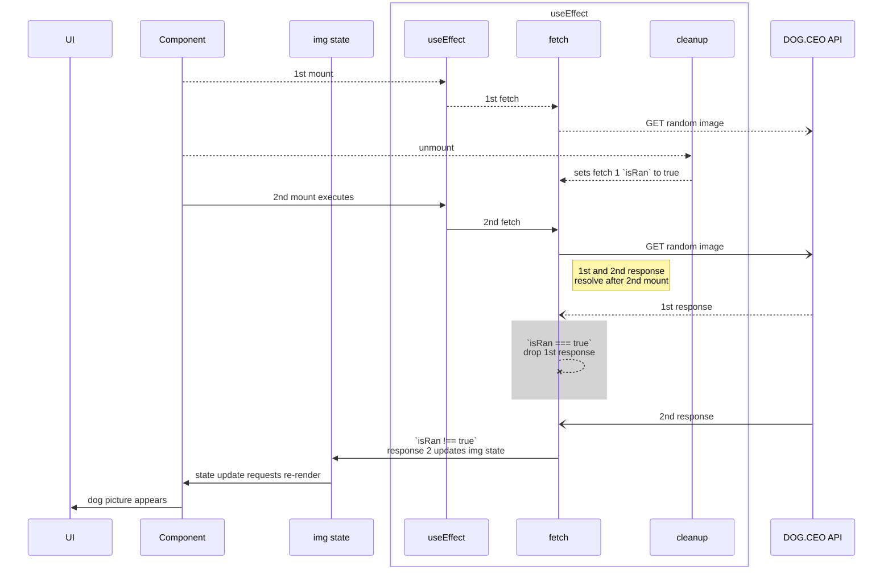

# Week-07

## Introduction

### Topics Covered

- Data Fetching
- UI Update Strategies

### Lesson Objectives

By the end of this lesson, we will:

#### Objective 1: Data Fetching

- Discuss data fetching in React applications to send and receive data
- Implement data fetching to retrieve and save data to manage application state

#### Objective 3: UI Update Strategies

- Examine pessimistic and optimistic UI update strategies related to how they impact a user's experience
- Implement an optimistic UI update strategy and handle failure scenarios where we need to revert changes

## Discussion Topics

### Data Fetching

Integrating with an API is a common development task for SPAs. Seldom do they operate without pulling in external data. We can use established APIs for viewable information such as [news articles](https://medium.com/rakuten-rapidapi/top-10-best-news-apis-google-news-bloomberg-bing-news-and-more-bbf3e6e46af6), [movie summaries](https://developer.themoviedb.org/docs/getting-started), or [important Pokemon facts](https://pokeapi.co/?ref=public-apis). For interactive data, we usually work with a custom server hosting API to fetch data that is tailored for use in the UI. This can include user profile or account information, article or video view history, forum posts, and so on. Since some of this data is meant to be managed by the user, we also need to be able to save data changes to the backend.

Most of these data fetching tasks can be categorized into one of four basic tasks - creating, reading, updating, and deleting. These are so common across applications that they are collectively referred to as CRUD operations. Each type of operation uses a specific fetch method when creating a network request.

- **Create** - "POST"
- **Read** - "GET" - this is the default action when a fetch method is not specified
- **Update** - "PUT" or "PATCH"
	- PUT is used to completely replace an existing record with new data
	- PATCH only changes some parts of a record. Eg - a user updates their username then that field only is updated in the record
- **Delete** - "DELETE"

Every network request is a very slow process from the perspective of a browser. During a data request, we want to avoid making JavaScript to wait for the request to resolve before it continues running. Since JavaScript shares the main thread with other browser tasks, processing a network request synchronously causes the browser to become unresponsive. To allow the main thread to continue executing while the request is not yet fulfilled, we turn to *[Promises](https://developer.mozilla.org/en-US/docs/Web/JavaScript/Reference/Global_Objects/Promise)*. This article, [States and Fates](https://github.com/domenic/promises-unwrapping/blob/master/docs/states-and-fates.md) helps explain the terminology promises use. There are two approaches to promises and asynchronous JavaScript code: using a promise's `then/finally/catch `methods or asynchronous functions with `await`.

> [!note]
> From here on, we will shorten **asynchronous** to **async** since that term is more frequently used than the full word.

#### Then/Finally/Catch

Using `then`, `finally`, and `catch` with fetch allows us to handle async operations with promise chaining. We can chain multiple `then` (or [`thenable`](https://developer.mozilla.org/en-US/docs/Web/JavaScript/Reference/Global_Objects/Promise#thenables) ) blocks together to process a response. We use `.catch` for error handling and `.finally` to run code after a promise settles, regardless of its outcome. This approach provides explicit control over async code execution flow. The example code below fetches a url for a random dog picture and then appends it to an html document body. Regardless if it is successful or throws, the `.finally` logs a statement to the console.

```jsx

fetch("https://dog.ceo/api/breeds/image/random")
  .then((resp) => {
	if (!resp.ok) {
	  throw new Error(resp.status);
	}
	return resp.json();
  })
  .then((data) => {
	if (data.status != "success") {
	  throw new Error(data.status);
	}
	placeImage(data.message);
  })
  .catch((error) => {
	console.log(error.message);
  }).finally(() => {
	  console.log("action completed")
  })

function placeImage(url){
	const img = document.createElement("img");
	img.src = url;
	document.body.append(img);
}

```

#### Async/Await

Async/await, which also uses promises, is another JavaScript feature that allows us to write async code - but in a synchronous[^synchronous] style. In an async function we use the `await` keyword to pause the function's execution until a promise is resolved. The main thread can continue on with other JavaScript code or browser tasks during this time. Once the promise fulfills or is rejected, execution of the async function resumes and it has. A try/catch block is used to handle errors in async fetch operations when using async/await. The below is the async/await equivalent of the code from the previous example. We end up with code that slightly easier to read so we will continue using this approach.

```javascript

const fetchDog = async () => {
  try {
	const resp = await fetch("https://dog.ceo/api/breeds/image/random");
	if (!resp.ok) {
	  throw new Error(resp.status);
	}
	const data = await resp.json();
	if (data.status != "success") {
	  throw new Error(data.status);
	}
	placeImage(data.message)
  } catch (error) {
	console.error(error.message);
  } finally {
	  console.log("action completed")
  }
};

function placeImage(url){
	const img = document.createElement("img");
	img.src = url;
	document.body.append(img);
}
fetchDog()
```

#### GET with useEffect

There are libraries that help us integrate network requests but the simplest way to get started us with `useEffect` and a `GET` request. Remember that this hook is used to [synchronize data with external systems](https://react.dev/learn/synchronizing-with-effects). Whenever a component first mounts the useEffect runs regardless its list of dependencies. We can take advantage of this to initiate a fetch request when `App` or some other component first mounts.

We place the fetch request into the parent component that maintains relevant state. The `useEffect` function is synchronous and expects there to be either 1.) no return value or 2.) a cleanup function. Fetch always returns a promise which will cause problems with the `useEffect`. Also, the `await` keyword is only available inside async functions. To get around these limitations, we declare and execute an async function containing the fetch inside the `useEffect` as seen in the example below. We're sticking with dogs for now, so this component includes the same fetch but adapted to work in a component and is [immediately invoked](https://developer.mozilla.org/en-US/docs/Glossary/IIFE) after it is defined.

```jsx
import { useEffect, useState } from "react";

export default function RandomDogPicture() {
  const [img, setImg] = useState(null);
  const [error, setError] = useState("");

  useEffect(() => {
    const url = "https://dog.ceo/api/breeds/image/random";
    //fetchDog is now an IIFE
    (async () => {
      try {
        const resp = await fetch(url);
        if (!resp.ok) {
          throw new Error(resp.status);
        }
        const data = await resp.json();
        if (data.status != "success") {
          throw new Error(data.status);
        }
        setImg(data.message);
      } catch (error) {
        setError(error.message);
      }
    })();
  }, []);

  return (
    <>
      {error && <p>{error}</p>}
      
    </>
  );
}
```

> [!important]
> If you're coding along, you may have already noticed the occasional double image change when the app first loads. We need to resolve this bug.

Remember that in the development environment [[Code The Dream/Intro to React V3/Curriculum/Week-02#Built-in Components|StrictMode]] causes components to mount twice to expose impure component functions. This means that the useEffect is firing twice so two network requests are being sent off in rapid succession. In most other API fetch scenarios the data that is returned is same between the requests. The double mount in this typical case does not cause a problem with the UI. Since the [DOG CEO](https://dog.ceo) API returns a different picture for each request, the differing results of the two fetches causes our application to behave in an undesired manner.

 We discuss rate limiting in [[Code The Dream/Intro to React V3/Curriculum/Week-09#Objective 1 Limiting Network Requests|Week-09]] but it's worth looking at a way to fix the component's behavior. As a good coding practice, we do not want to modify our component to behave differently based on StrictMode's presence. *This is akin to disabling ESLint warnings in an IDE - it hides warnings about undesired behavior but does not fix it!* We cannot prevent the network request from happening twice but we can ignore the results of the first request. We accomplish this by setting a boolean `let isRan = false` at the beginning of the `useEffect`. We then only call `setImg(data.message)` if `isRan` is false when the the `if` block is finally evaluated. The final, and most important detail is to include a cleanup function that toggles `isRan` to true. Let's look at the refactored code:

```jsx
import { useEffect, useState } from "react";

export default function RandomDogPic() {
  const [img, setImg] = useState(null);
  const [error, setError] = useState("");
  const url = "https://dog.ceo/api/breeds/image/random";

  useEffect(() => {
    let isRan = false;
    (async () => {
      console.log("useEffect running");
      try {
        const resp = await fetch(url);
        if (!resp.ok) {
          throw new Error(resp.status);
        }
        const data = await resp.json();
        if (data.status != "success") {
          throw new Error(data.status);
        }
        if (isRan) {
          console.log("skipped setImg()");
        } else {
          console.log("ran setImg()");
          setImg(data.message);
        }
      } catch (error) {
        setError(error.message);
      }
    })();
    return () => {
      console.log("cleanup performed");
      isRan = true;
    };
  }, []);

  return (
    <>
      {error && <p>{error}</p>}
      
    </>
  );
}
```

To appreciate what this is accomplishes, we have to consider where the execution is being paused and the lexical scope of `isRan`. `isRan` is declared inside of the useEffect so is available to anything else written in that scope. This means that the cleanup function has access to it. This function also happens to be a [closure](https://developer.mozilla.org/en-US/docs/Web/JavaScript/Closures) so continues to have access to `isRan` whenever it is eventually executed.

Going back into the function that runs fetch, code execution stops at `const resp = await fetch…`. While the fetch is pending, execution has not reached the `if` statement that evaluates `isRan`. As a result, if the cleanup function runs while the fetch is still pending, `isRan` is changed to `true` so the state update function, `setImg` isn't called. This drops the request's payload and avoids the changing image during the second render. In summary, the `RandomDogPic` component ends up ignoring the first request and displays the result of the second request.

The code above also includes a few `console.log` statements that provide us some insight into the execution order across the useEffect.

![[202412_0653PM-Firefox Developer Edition.gif]]

The following is logged to the console when the app first loads:

```console
[vite] connecting...                     client: 495:8
[vite] connected.                       client: 614:14

useEffect running                       App.jsx: 27:14
cleanup performed                       App. jsx:49:14
useEffect running                        App.]sx:27:14
skipped setImg ()                        App.]sx:38:18
ran setImg()                            App. jsx:41:18
»
```

The diagram below illustrates the sequence of execution.



When the app is loaded it mounts the component which then executes its `useEffect`. This sends off a fetch request and returns a cleanup function. As soon as the component mounts, it is unmounted, firing the returned cleanup function which updates `isRan` to be true. The component then mounts again, causing `useEffect` to run, sending a second network request. After the API returns the first response, it's dropped because its instance of `isRan` is true. React uses the second request because useEffect does not run the cleanup function so its instance of `isRan` is still false. This allows the fetch to set the state variable. This finally gives us a cute puppy to look at!

Of course, seeing only one dog is boring! Let's add a button that will load a new random dog picture each time it is clicked. Unfortunately, because of the internal dependency `isRan`, the first fetch request cannot be re-used. We want to create another request for the button.

```jsx
//...component code
  const fetchNewDog = async () => {
    try {
      const resp = await fetch(url);
      if (!resp.ok) {
        throw new Error(resp.status);
      }
      const data = await resp.json();
      if (data.status != "success") {
        throw new Error(data.status);
      }
      setImg(data.message);
    } catch (error) {
      setError(error.message);
    }
  };
  //component code...
  return (
    <main>
      <button style={{ display: "none" }} onClick={fetchNewDog}>
        Another Please!
      </button>
      {error && <p>{error}</p>}
      
    </main>
  );
}
```

We can then update the JSX with the new button. `fetchDog` can be passed to the button's onClick handler props.

![[202412_0712PM-Firefox Developer Edition.gif|500]]

### Loading CTD-Swag with Product Data from an API

Let's get back to CTD and load the product list in from the API.

A copy of the backend API can be found in [this repo](https://github.com/royemosby/ctd-swag-backend). #placeholder/update-link Instructions on how to set up and run the server are found in the project's readme. You will need to have a postgres database running locally - plenty of guides to set this up can be found online - choose one for your specific operating system.

> [!warning]
> Avoid putting API or authentication data directly into an application. These values, referred to as environmental variables, change between environments (local, staging, production, etc.) and some information such as credentials or API tokens are sensitive information that we do not want to publish with our repo. It's very difficult to remove these values out of version control history if accidentally committed!

Assuming that the API is in place, the first step is to create a configuration file, `.env.local`, at the top level directory of CTD-Swag. After it is created, confirm that there is a `*.local` entry in the `.gitignore` so that version control is not tracking this file. As a Vite-specific security precaution, all variable keys must have the prefix `VITE_` to be available for use inside our code. For now, all we need is a `VITE_API_BASE_URL="localhost:8641"`. This is the URL that forms the base of our fetch request. We access that value using `import.meta.env.VITE_API_BASE_URL`.

Now that we can access the base url, we update `useEffect` to get the list of products. We don't need to worry about discarding one of the responses since the request should contain the same data between API calls.

Here's the updated `useEffect`:

```jsx
//App.jsx
//... component code
const baseUrl = import.meta.env.VITE_API_BASE_URL

useEffect(() => {
    (async () => {
      try {
        const resp = await fetch(`${baseUrl}/products`);
        if (!resp.ok) {
          throw new Error(resp.status);
        }
        const products = await resp.json();
        console.log(products);
        setInventory([...products]);
      } catch (error) {
        console.error(error);
      }
    })();
  }, []);
  //component code...
```

### UI Update Strategies

With this new knowledge and an API to interact with, we can strategize how to improve a user's experience with CTD-Swag. Let's add user accounts and a saved cart so a user can resume shopping if they leave our store.

 Before we plan these changes, we need to consider how to manage UI state as the application interacts with the API. Network operations, even on a fast connection, are not instantaneous. They take milliseconds to seconds to resolve. While that does not sound like much, it's enough time to to frustrate some users if we do not handle the intermediate state properly. Intermediate state simply refers to the state of the application during the time between when a user commits a change and when it is actually processed by a back end.

Do we want to make updates to the UI as soon as a user makes a change and then save it to the API's back end? Or do we want to make sure that the data is saved first before making updates to the UI? The first approach is known as an "optimistic" update while the second is "pessimistic". Setting the emotional tone of each word aside, they describe how we prioritize data and state synchronization. Each has its advantages and disadvantages.

#### Pessimistic

A pessimistic strategy places an emphasis on data integrity. This approach ensures that state of the UI accurately reflects the data as it is stored on the back end. Rather than speculating about the success of a transaction, we wait for the API to send a success or failure response and then use that response's payload to update application state.

For example, a person uses a bank's app to transfer money between two accounts. When they submit the transfer request, the interface doesn't automatically update account balances. Instead, it waits for the bank's server to process the request and send a response back. Usually during this time, the UI may show a spinning wheel or loading bar that lets the user know that the transaction is still pending. When a response is received it will contain updated account balance information that the application then uses to update state.

##### Advantages

- **Accurate State**: The UI's state accurately reflects the data saved on the back end
- **Simplicity**:Simpler to implement than optimistic strategies

##### Disadvantages

- **Slow**: UI feels sluggish to users even on fast internet connections

##### Best Used For

- **Data Integrity**: Maintaining the integrity and accuracy of data displayed in the UI, ensuring that updates are finalized and reflected accurately after successful confirmation from the backend.
- **Risk Mitigation**: When the impact of displaying incorrect or incomplete information in the UI is significant, a pessimistic approach reduces the risk of misleading users with incomplete or erroneous data.
- **Form Submissions**: In scenarios where form submissions require validation from the server before proceeding, especially in cases involving sensitive data or multi-step processes.
- **Compliance Requirements**: For applications subject to regulatory compliance or audit requirements, a pessimistic strategy helps enforce strict data validation and auditing controls.
- **Concurrency Control**: When dealing with shared resources or collaborative editing scenarios, pessimistic locking mechanisms help prevent conflicts and ensure data consistency.

#### Optimistic

The Merriam-Webster dictionary provides a definition for optimism as "an inclination to put the most favorable construction upon actions and events or to anticipate the best possible outcome". When approaching a UI change optimistically, we prioritize a responsive UI based on the assumption that most of the API interactions will succeed.

We still handle errors and failures but also need to incorporate mechanisms to roll back intermediate state changes. For example, a user of a social media app hits the like button on a post. A thumbs-up, smiley face, heart, or some other icon shows up in a reactions area along with other people's reaction icons. This happens instantaneously in the UI, indicating to the user that they've liked the post and can continue skimming their feed. Meanwhile, the app sends off a request to the social media platform's API with data needed for the backend to process the reaction. If all goes well, nothing else needs to be done. The UI is already updated and the API has applied the like to the post. However, if there's a failure while processing the request, the app needs to undo changes to the UI and notify the user that there was an issue.

##### Advantages

- **Perceived Performance**: Provides instant feedback to users without waiting for server responses, enhancing the perceived speed of the application.
- **Improved Responsiveness**: Enhances user experience by creating a smoother and more responsive interface.
- **Offline Support**: Enables functionalities even when offline by immediately updating the UI, with actual data sync happening later.

##### Disadvantages

- **Reconciliation of Server Responses with Local State**: Requires careful handling to ensure a seamless user experience and data integrity.
- **Data Consistency**: Risk of inconsistency if the optimistic update doesn't match the actual server response.
- **Recovery From Errors**: Handling errors becomes more complex as you need to manage discrepancies between the optimistic update and server response.

##### Best Used For

- **Highly Responsive Interfaces:** When user experience and perceived speed are crucial, such as interactive messaging platforms or collaborative editing tools.
- **Non-critical Data Operations:** Suitable for non-critical operations where occasional inconsistencies are acceptable and can be resolved later without significant impact on user experience.
- **Offline Functionality:** Useful for scenarios where users need to perform actions offline and sync data later, like note-taking apps or task managers.

#### A Note on Ephemeral State

State changes caused by interaction with interface elements don't create data worth saving. These temporary UI state values should not be synchronized with the back end. Here are a few examples:

1. **Form Field Validation State:** Flags indicating the validity of user input in client-side form validation.
2. **Sorting or Filtering Preferences:** User-defined sorting or filtering options applied to view data on the client side, such as changing the order of displayed items in a list.
3. **UI Theme Preferences:** User selected themes, color schemes, or layout preferences for the interface that enhance the user experience but are specific to individual users and do not affect shared data. *This depends on the importance placed on user experience customization for the specific app.*
4. **Local Notifications:** Displaying temporary notifications or alerts within the app for user feedback.
5. **Client-Side Calculations:** Intermediate results or calculations performed in the UI for dynamic updates or real-time feedback.

### Saving Users and Cart State in CTD-Swag

> [!note]
> We will not be using the [`useOptimistic` hook](https://react.dev/reference/react/useOptimistic#reference). Implementing this hook makes little sense without a solid understanding of how to plan for error handling and recovery.

We look at the tasks a user should be able to take and expected application behavior to determine how to break work down into components and supporting code.

> [!drafting note] #drafting-note
> probably should use simulated login if auth isn't finished

- **A new user needs to be able to sign up for an account.**
	- a user details form needs to be displayed by a hitting a sign up button
	- a POST request needs to be sent to `/users` on submit
	- on a successful API response, the user is logged in
		- response data will include user info:
			- account info, excluding password
			- user id - needed to create a fetch request to GET cart
			- JWT authentication token saved as HttpOnly cookie
- **An existing user needs to be able to sign in**
	- an authentication form needs to be displayed by hitting a login button
		- the login form can be re-used by conditionally displaying certain fields and the correct button
	- a POST request needs to be sent to `/login`
	- on a successful API response, the user is logged in (this will be same data as sign up response )
		- response data will include user info:
			- account info, excluding password
			- user id - needed to create a fetch request to GET cart
			- JWT authentication token needs be saved as an HttpOnly cookie
- **An existing user's cart should be updated remotely with any changes as they are com**
	- when user is signed in, a fetch GETs the user's shopping cart.
	- when user adds item to cart
		- cart in UI should update automatically
		- PUT request containing the full cart is sent to API
			- success is silent
			- failure rolls back cart change and displays error message to user
	- when user edits cart
		- only local state is updated while making changes
		- when user confirms, PUT request containing cart is sent to API with same outcomes as above
- **An existing user should stay logged into CTD-Swag between sessions**
	- application automatically includes cookie containing JWT
		- If it exists it will send user payload same as registering or logging in

> [!drafting note] #drafting-note
> braindump of other possible endpoints:
> GET api/v1/products
> GET api/v1/products/:id
> POST api/v1/login
> POST api/v1/users
> PUT api/v1/users/:id
> GET api/v1/cart
> POST api/v1/cart

## Weekly Assignment Instructions

### Expected App Capabilities

After completing this week's assignment, the app should be able to:

- capability 1
- capability 2
- capability n

### Instructions Part 1

 1. [ ] step 1
 2. [ ] step 2
 3. [ ] step n

### Instructions Part 2

 1. [ ] step 1
 2. [ ] step 2
 3. [ ] step n

### Instructions Part n

 1. [ ] step 1
 2. [ ] step 2
 3. [ ] step n

### Stretch Goal: Suspense

- Use the built-in Suspense component to display fallback content

## References and Further Reading

### Data Fetching

- [Using the Fetch API (MDN)](https://developer.mozilla.org/en-US/docs/Web/API/Fetch_API/Using_Fetch)
- [Fetch (javascript.info)](https://javascript.info/fetch)
- [Modern API data-fetching methods in React (LogRocket Blog)](https://blog.logrocket.com/modern-api-data-fetching-methods-react/)

### Conditional Rendering

- [Conditional Rendering (React docs)](https://react.dev/learn/conditional-rendering)
- [React Conditional Rendering (freeCodeCamp)](https://www.freecodecamp.org/news/react-conditional-rendering/)

### UI Update Strategies

- [Optimistic and Pessimistic UI Rendering Approaches (Medium)](https://medium.com/@whosale/optimistic-and-pessimistic-ui-rendering-approaches-bc49d1298cc0)
- [A Primer on Optimistic UI (Dan Imhoff)](https://imhoff.blog/posts/optimistic-ui-primer)
- [What is a Toast Notification? (UX Pickle)](https://uxpickle.com/what-is-a-toast-notification/)
- [What is Canary Testing? (TechTarget)](https://www.techtarget.com/whatis/definition/canary-canary-testing)

[^synchronous]: Synchronous code executes line by line, each operation blocking the execution until it completes. This results in a predictable and easier-to-follow flow of control.
